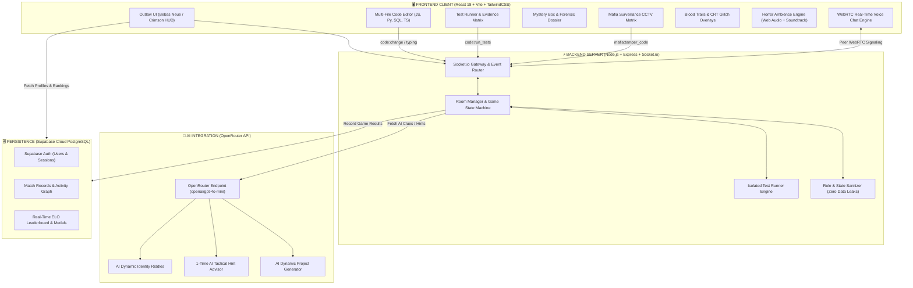
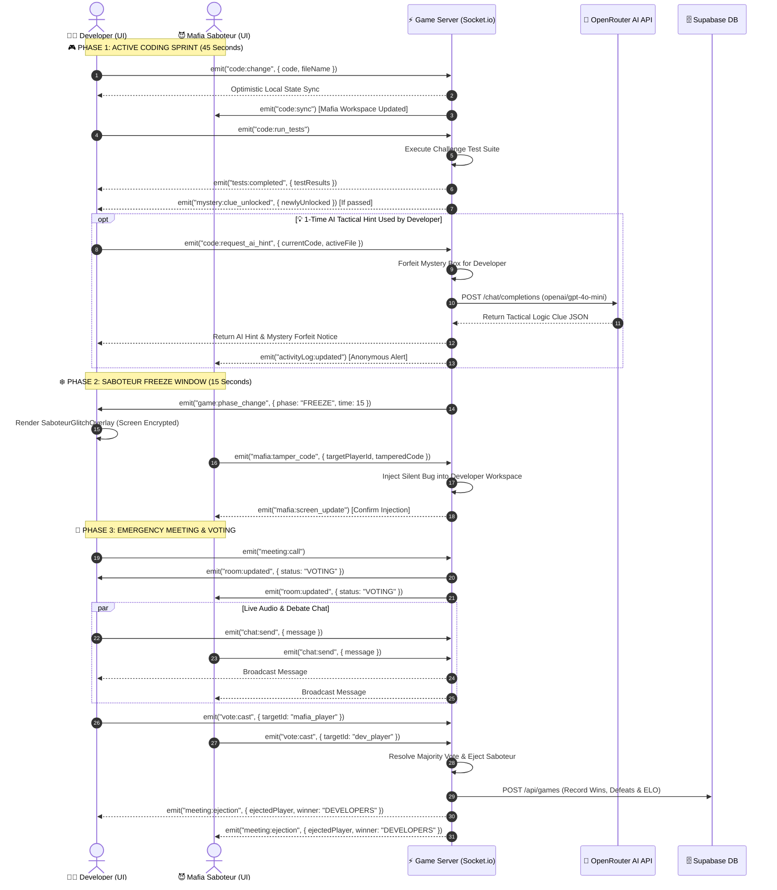

# 🩸 CODE MAFIA II (ChidiyaGHAR Ignite) 🕵️‍♂️⚡

<div align="center">


**A high-stakes real-time collaborative coding and psychological social deduction multiplayer platform.**  
*Fix code regressions, pass test suites, uncover identity ciphers, and eliminate the undercover Saboteur before the timer expires.*

</div>

---

## 📑 Table of Contents
1. [Overview & Game Concept](#-overview--game-concept)
2. [High-Level System Architecture](#-high-level-system-architecture)
3. [Real-Time Sequence & Game Loop Flowchart](#-real-time-sequence--game-loop-flowchart)
4. [Key Feature Breakdown](#-key-feature-breakdown)
5. [Repository Structure](#-repository-structure)
6. [Quickstart & Local Setup](#-quickstart--local-setup)
7. [Environment Variables](#-environment-variables)
8. [Real-Time WebSocket Protocol](#-real-time-websocket-protocol)

---

## 🎯 Overview & Game Concept

In **Code Mafia II**, players enter an Outlaw Coding Arena with assigned secret roles:
- **🛠️ Developers (Stabilizers)**: Collaborate in real-time to debug complex codebases, pass unit test suites, unlock Mystery Box forensic clues, and deduce who among them is sabotaging the build.
- **😈 Code Mafia (Saboteurs)**: Infiltrate the squad, monitor teammates via secret CCTV screens, inject stealth bugs during **15-second Freeze Windows**, and bluff their way through Emergency Voting Meetings.

---

## 🏗️ High-Level System Architecture



---

## 🔄 Real-Time Sequence & Game Loop Flowchart

The following sequence diagram models the real-time communication flow across the **45s Developer Sprint**, **15s Mafia Freeze Window**, **1-Time AI Hint Execution**, and **Emergency Meeting Ejections**:



---

## 🌟 Key Feature Breakdown

### 🩸 1. Rockstar Red Dead Outlaw UI & Visual FX
- **Crimson & Carbon Aesthetics**: Sleek dark carbon `#0a0506` surfaces framed with textured crimson `#2d1215` borders and gold/amber `#fcd34d` typography.
- **Blood Sparks Cursor Trail**: Real-time particle physics simulating arterial splatters and ember sparks following cursor movement.
- **CRT Glitch & Scanline FX**: Cinematic visual interference during the 15-second sabotage freeze phase.

### 🎙️ 2. Procedural Horror Ambience & Integrated Soundtrack
- **Main Soundtrack Engine**: Integrated high-fidelity looped horror theme audio (`horror_theme.weba`).
- **Web Audio Synthesis**: 3-formant vocal tract filter simulating continuous indistinct human whispers (`360Hz`, `980Hz`, `2400Hz`), 45Hz binaural sub-bass drone, rhythmic 52-BPM heartbeat thump, and tritone horror chords.
- **Demonic Voice Synthesizer**: Periodic raspy psychological whisper broadcasts via browser speech synthesis.

### 💡 3. 1-Time AI Tactical Hint Engine (OpenRouter API)
- **Emergency AI Assistance**: Available once per match strictly for Developers stuck on failing test cases.
- **Strategic Trade-Off**: Activating the AI Hint instantly forfeits Mystery Box identity unboxings for that mission.
- **OpenRouter AI Backend**: Analyzes code, error stack traces, and edge cases to generate high-yield logic hints without spoiling the full solution.

### 📹 4. Secret Mafia CCTV Multi-Screen Surveillance
- **Live Screen Mirroring**: Mafia agents monitor all developer workspaces simultaneously in real-time.
- **Remote Tampering**: During the 15s Freeze phase, Mafia can select any developer's screen and inject stealth syntax bugs or logical inversions.

### 🧩 5. Mystery Box Identity Riddles & Forensic Matrix
- **Automated Clue Unboxing**: Passing unit test suites unlocks rhyming wordplay riddles tailored to the Mafia's real username, initial, and avatar.
- **Suspect Probability Matrix**: Live percentage scoring calculating the likelihood of each player being the saboteur based on revealed letter fragments.

### 🏆 6. Real-Time Leaderboard & GitHub-Style Activity Heatmap
- **Profile Dossier**: Displays ELO ratings, global rank, faction win-rates, and medals.
- **52-Week Contribution Grid**: Visualizes match completions in a GitHub-inspired crimson contribution heatmap.

---

## 📂 Repository Structure

```
ChidiyaGHAR_Ignite/
├── frontend/                          # React + Vite Client
│   ├── public/
│   │   ├── horror_theme.weba          # Main background soundtrack
│   │   └── images/                    # UI assets
│   ├── src/
│   │   ├── components/
│   │   │   ├── AiHintModal.jsx        # 1-Time AI Tactical Hint HUD
│   │   │   ├── AmbienceAudioControl.jsx # Global soundscape controller
│   │   │   ├── BloodSparksTrail.jsx   # Particle cursor trail
│   │   │   ├── CodeEditor.jsx         # Multi-file tabbed IDE
│   │   │   ├── LeaderboardModal.jsx   # Outlaw Leaderboard & Rankings
│   │   │   ├── MafiaSurveillanceDashboard.jsx # CCTV Surveillance
│   │   │   ├── MysteryBoxModal.jsx    # Clue reveal unboxing popup
│   │   │   ├── MysteryCluesDossier.jsx# Forensic evidence board
│   │   │   ├── SaboteurGlitchOverlay.jsx # 15s Freeze overlay
│   │   │   ├── SuspectsRosterBoard.jsx# Polaroid crime board with EKG
│   │   │   ├── UserProfileModal.jsx   # Outlaw dossier & heatmap
│   │   │   └── VotingModal.jsx        # Dual-pane voting & debate chat
│   │   ├── services/
│   │   │   ├── horrorAmbienceService.js # Procedural audio + BGM engine
│   │   │   ├── socket.js              # Socket.io client wrapper
│   │   │   ├── voiceService.js        # Peer WebRTC voice service
│   │   │   └── auth.js                # Local & Supabase session manager
│   │   ├── App.jsx                    # Root arena orchestrator
│   │   └── main.jsx
│   └── package.json
│
├── backend/                           # Node.js + Express + Socket.io Server
│   ├── src/
│   │   ├── db/
│   │   │   └── supabase.js            # Match history & ELO persistence
│   │   ├── game/
│   │   │   ├── RoomManager.js         # Game state machine & phase ticker
│   │   │   ├── TestEngine.js          # Sandboxed JS, Py, SQL test executor
│   │   │   └── challenges.js          # Challenge bank
│   │   ├── services/
│   │   │   ├── aiChallengeService.js  # OpenRouter dynamic challenge generator
│   │   │   ├── aiHintService.js       # OpenRouter 1x tactical hint engine
│   │   │   └── aiRiddleService.js     # OpenRouter Mafia identity riddler
│   │   ├── routes/
│   │   │   ├── api.js                 # Leaderboard & profile REST routes
│   │   │   └── auth.js                # Authentication endpoints
│   │   └── server.js                  # Gateway entrypoint & socket events
│   └── package.json
│
├── supabase_schema.sql                # SQL migration schema for Supabase
└── README.md                          # Master documentation
```

---

## ⚡ Quickstart & Local Setup

### 1. Prerequisites
- **Node.js**: v18.0.0 or higher
- **npm** or **pnpm** installed

### 2. Installation
Clone the repository and install dependencies in both folders:

```bash
# Backend dependencies
cd backend
npm install

# Frontend dependencies
cd ../frontend
npm install
```

### 3. Run Development Servers
Open two terminal windows:

```bash
# Terminal 1: Backend Server (Port 5000)
cd backend
npm run dev

# Terminal 2: Frontend Client (Port 5173)
cd frontend
npm run dev
```

Visit `http://localhost:5173` in your browser.

---

## 🔐 Environment Variables

### Backend Configuration (`backend/.env`)
```env
PORT=5000
CLIENT_URL=http://localhost:5173

# OpenRouter AI (Exclusive AI Provider)
OPENROUTER_API_KEY=sk-or-v1-xxxxxxxxxxxxxxxxxxxxxxxxxxxxxxxx
OPENROUTER_BASE_URL=https://openrouter.ai/api/v1
OPENROUTER_MODEL=openai/gpt-4o-mini

# Supabase Persistence (Optional for local testing, required for DB match logs)
SUPABASE_URL=https://xxxxxxxx.supabase.co
SUPABASE_SERVICE_ROLE_KEY=eyJh...
```

### Frontend Configuration (`frontend/.env`)
```env
VITE_SOCKET_URL=http://localhost:5000
VITE_BACKEND_URL=http://localhost:5000
VITE_SUPABASE_URL=https://xxxxxxxx.supabase.co
VITE_SUPABASE_ANON_KEY=eyJh...
```

---

## 📡 Real-Time WebSocket Protocol

| Event Name | Direction | Payload Description |
|---|---|---|
| `room:create` | Client ➔ Server | Create new match room with custom settings |
| `room:join` | Client ➔ Server | Join existing room code with username & avatar |
| `game:start` | Client ➔ Server | Host initiates role distribution and countdown |
| `game:phase_change` | Server ➔ Client | Broadcasts transition between 45s Coding and 15s Freeze |
| `code:change` | Client ➔ Server | Syncs active code changes and modular multi-files |
| `code:run_tests` | Client ➔ Server | Executes test suite against isolated runner |
| `code:request_ai_hint` | Client ➔ Server | Requests 1-time AI tactical hint (forfeits Mystery Box) |
| `mystery:clue_unlocked` | Server ➔ Client | Broadcasts identity riddle when unit tests pass |
| `mafia:tamper_code` | Client ➔ Server | Mafia injects remote tampering during 15s Freeze |
| `meeting:call` | Client ➔ Server | Triggers emergency voting conference |
| `vote:cast` | Client ➔ Server | Submits secret vote against suspected operative |
| `meeting:ejection` | Server ➔ Client | Resolves voting outcome and updates win/loss status |

---

<div align="center">

🩸 **Code Mafia II — May the cleanest code win.**

</div>